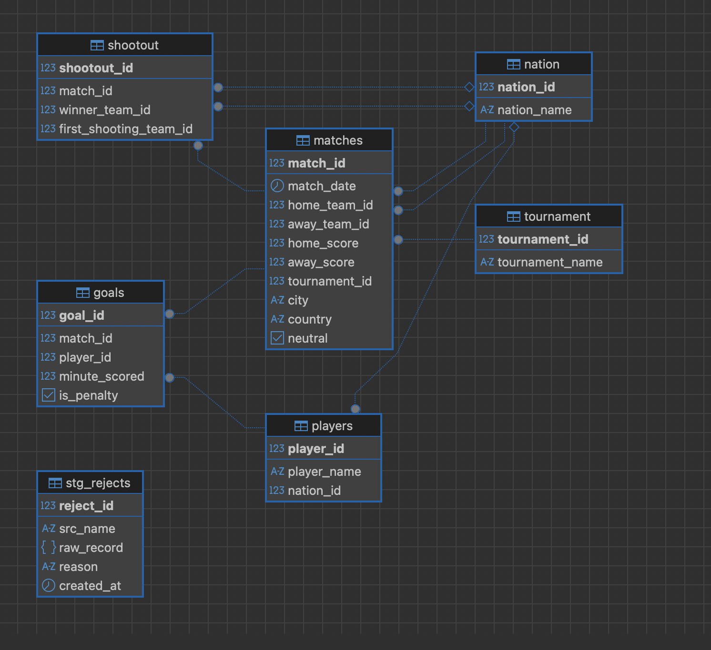

# README

- [International Football ETL Pipeline](#international-football-etl-pipeline)
  - [Project Overview](#project-overview)
  - [Architecture](#architecture)
  - [Data Sources](#data-sources)
  - [Tools & Technologies](#tools--technologies)
  - [Project Structure](#project-structure)
  - [ETL Pipeline](#etl-pipeline)
    - [1. Extract](#1-extract)
    - [2. Transform](#2-transform)
    - [3. Load](#3-load)
  - [Database Schema](#database-schema)
  - [Installation & Usage](#installation--usage)
    - [1. Clone the Repository](#1-clone-the-repository)
    - [2. Install Dependencies](#2-install-dependencies)
    - [3. Configure PostgreSQL](#3-configure-postgresql)
    - [4. Start the API Server](#4-start-the-api-server)
    - [5. Run the ETL Pipeline](#5-run-the-etl-pipeline)
    - [6. Verify Database Output](#6-verify-database-output)
  - [Testing](#testing)
  - [Results](#results)
  - [Future Enhancements](#future-enhancements)

---

# International Football ETL Pipeline

A production-ready **ETL (Extract, Transform, Load)** pipeline that integrates football match data from CSV files and REST APIs into a normalized PostgreSQL database.

The project demonstrates fundamental data engineering concepts including multi-source extraction, data transformation, validation, normalization, database loading, automated testing, and error logging.

---

# Project Overview

This project was developed as part of the **Cognizant Data Engineering Program**.

The pipeline performs the following tasks:

- Extracts football match data from CSV files and REST APIs.
- Cleans and standardizes raw datasets.
- Removes duplicate and invalid records.
- Validates required fields and data types.
- Loads transformed data into a normalized PostgreSQL database.
- Maintains referential integrity using primary and foreign keys.
- Logs rejected records for auditing and troubleshooting.

The result is a repeatable, analytics-ready data warehouse for international football statistics.

---

# Architecture

```text
                CSV Files
                    │
                    │
                    ▼
               Data Extraction
                    ▲
                    │
                REST API
                    │
                    ▼
            Data Transformation
                    │
                    ▼
             Data Validation
                    │
                    ▼
         PostgreSQL Data Warehouse
                    │
                    ▼
         SQL Queries & Data Analysis
```

---

# Data Sources

The pipeline collects football data from two sources:

- Historical football CSV datasets
- Football REST API

Data includes:

- Nations
- Tournaments
- Matches
- Players
- Goals
- Shootouts

---

# Tools & Technologies

### Languages

- Python
- SQL

### Python Libraries

- pandas
- psycopg2
- requests
- logging
- json
- pytest

### Database

- PostgreSQL

### Development Tools

- Visual Studio Code
- DBeaver
- Git
- GitHub

---

# Project Structure

```text
Project_1/
│
├── data/
│
├── etl_pipeline/
│   ├── api.py
│   ├── configuration.py
│   ├── database.py
│   ├── extract.py
│   ├── load.py
│   ├── transform.py
│   └── etl.py
│
├── tests/
│   ├── test_pipeline.py
│   └── test_etl_pipeline.py
│
├── logs/
│
├── requirements.txt
│
└── README.md
```

---

# ETL Pipeline

## 1. Extract

The extraction phase retrieves football data from multiple sources.

Tasks include:

- Reading CSV datasets
- Calling REST API endpoints
- Loading raw data into Pandas DataFrames

---

## 2. Transform

The transformation phase prepares raw data for loading.

Processing includes:

- Normalizing column names
- Converting data types
- Formatting dates
- Removing duplicates
- Handling missing values
- Validating required fields
- Standardizing data across multiple sources

---

## 3. Load

The loading phase inserts cleaned data into PostgreSQL.

Features include:

- Automatic database initialization
- Normalized relational tables
- Primary and foreign key relationships
- Duplicate prevention
- Transaction management
- Reject logging for invalid records

---

# Database Schema

The pipeline loads data into a normalized PostgreSQL schema containing tables such as:

- nation
- tournament
- matches
- players
- goals
- shootout
- stg_rejects

Each table is connected using primary and foreign keys to ensure referential integrity and minimize data redundancy.

---

# Installation & Usage

## 1. Clone the Repository

```bash
git clone https://github.com/Issouf-Diarrassouba/ETL_Pipeline.git

cd international-football-etl
```

---

## 2. Install Dependencies

```bash
pip install -r requirements.txt
```

---

## 3. Configure PostgreSQL

Update your PostgreSQL connection settings inside:

```text
etl_pipeline/configuration.py
```

Configure:

- Host
- Port
- Database
- Username
- Password

---

## 4. Start the API Server

Before running the ETL pipeline, start the API server.

```bash
python -m etl_pipeline.api
```

---

## 5. Run the ETL Pipeline

Execute the complete ETL process.

```bash
python -m etl_pipeline.etl
```

The pipeline will:

- Extract football datasets
- Transform and validate records
- Load data into PostgreSQL
- Log rejected records
- Display execution status

---

## 6. Verify Database Output

Use DBeaver, pgAdmin, or another PostgreSQL client to inspect the populated tables.

Example SQL query:

```sql
SELECT *
FROM football.matches
LIMIT 10;
```

---

# Testing

The project includes automated testing using **Pytest**.

Run all tests:

```bash
PYTHONPATH=. pytest tests/
```

Current test coverage includes:

- CSV extraction
- Data transformation
- Database connection
- Database initialization
- Data loading
- ETL pipeline execution

**Current Status**

- 11 automated tests passed

---

# Results

After successful execution, the pipeline produces:

- A normalized PostgreSQL football database
- Clean, validated football datasets
- Referentially linked tables
- Reject logging for invalid records
- Analytics-ready data for SQL querying and visualization

The completed database can be explored using DBeaver or any PostgreSQL client.

---

# Future Enhancements

Potential improvements include:

- Docker containerization
- Apache Airflow workflow scheduling
- AWS cloud deployment
- Power BI or Tableau dashboards
- Real-time API ingestion
- Incremental ETL processing
- Machine learning analytics


Signed BY : ISSOUF DIARRASSOUBA